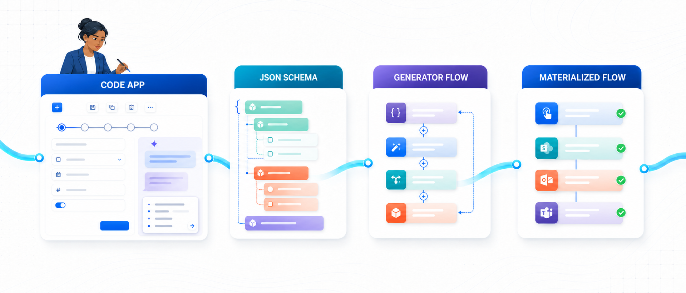
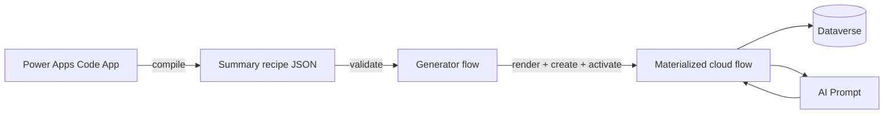

<div align="center">
  
  <h1>Summary Studio</h1>
  <p><strong>Declarative AI summary automation for Microsoft Dataverse and Power Automate.</strong></p>
  <p>
    <a href="https://powerplatformireland.com/talks-26/">Irish Power Platform Summit 2026</a>
    · AI Summaries in Dataverse: Above and Beyond
  </p>
</div>

<p align="center">
  
  
  
  
  
  <a href="LICENSE"></a>
</p>



Summary Studio turns a business requirement for an AI-generated summary into a versioned, testable contract. A Power Apps Code App captures the intent; Dataverse stores the configuration; a generator flow interprets the JSON contract and materializes a specialized cloud flow.

> Configure the summary once. Generate the automation from a governed contract.

## Why this exists

Out-of-the-box summaries are useful, but enterprise implementations usually need more control:

- which Dataverse tables, columns, relationships, and filters become context;
- which reusable AI Prompt and model are invoked;
- where the result and generation metadata are stored;
- when regeneration occurs and how loops are prevented;
- how the implementation is versioned, audited, and extended.

Summary Studio separates those concerns. Makers work with a guided configuration experience; the backend receives a deterministic contract instead of loosely coupled UI choices.

## Architecture

| Stage | Responsibility | Output |
| --- | --- | --- |
| **Code App** | Guides the maker through source data, prompt, destination, and execution decisions, with an optional conversational assistant. | Validated configuration |
| **JSON Schema** | Defines the stable boundary between the UI and automation backend. | Versioned summary recipe |
| **Generator Flow** | Validates the recipe, renders the cloud-flow definition, creates the flow, and activates it. | Specialized flow definition |
| **Materialized Flow** | Retrieves Dataverse context, invokes the AI Prompt, writes the summary, and records telemetry. | Governed summary automation |

The Code App does not generate arbitrary flows. It selects from supported architectural patterns and compiles the selected pattern into a contract the generator understands.



## Configuration journey

The editor follows a familiar model-driven Business Process Flow pattern:

1. **Data and context:** select the primary table, fields, relationships, and record window.
2. **Prompt and model:** bind an AI Prompt, map runtime inputs, and review token estimates.
3. **Destination:** choose the output table and column, retention mode, and metadata policy.
4. **Execution:** select an event-driven, scheduled, or on-demand trigger pattern.
5. **Review and publish:** validate the contract and hand it to the generator backend.

Every editing action uses an in-context side pane. The main canvas remains compact enough to present the complete decision path without turning the application into a generic flow designer.

The assistant can also accept a request such as “Create an account summary for sales managers, refresh it when revenue changes, and retain the last five versions.” It proposes structured recipe changes; the maker reviews those changes in the same editor before anything is published. Conversation is an authoring surface, not an alternative execution path.

## Dataverse model

Summary Studio uses standard AI Builder metadata together with a small configuration and telemetry layer.

| Table | Purpose |
| --- | --- |
| `msdyn_aimodel` | AI Builder model and prompt definition metadata. |
| `msdyn_aiconfiguration` | Model configuration related to `msdyn_aimodel` through the standard 1:N relationship. |
| `csp_aisummaryconfig` | Versioned summary recipe consumed by the generator flow. |
| `csp_aisummarycache` | Optional history/cache for generated summaries. |
| `csp_aiusage` | Run status, latency, token usage, and target-record telemetry. |
| `account.csp_aisummary` | Example destination column used by the summit demo. |

The prompt picker is intended to surface reusable AI Builder prompts from `msdyn_aimodel` and their related `msdyn_aiconfiguration` records. The summary recipe stores the stable prompt binding required by the generator.

## Summary recipe contract

The canonical schema lives at [`schemas/summary-recipe.schema.json`](schemas/summary-recipe.schema.json). A complete example is available at [`examples/account-operations.recipe.json`](examples/account-operations.recipe.json).

```json
{
  "version": "3.0",
  "source": {
    "entity": "account",
    "fields": ["name", "revenue", "description"],
    "relationships": [
      { "entity": "activitypointer", "windowDays": 30, "maxRecords": 12 }
    ]
  },
  "prompt": {
    "id": "<ai-model-id>",
    "key": "account-operations",
    "model": "gpt-4.1-mini",
    "inputs": { "account_context": "compiled.primaryAndRelated" }
  },
  "output": {
    "entity": "account",
    "field": "csp_aisummary",
    "cache": true,
    "preserveHistory": false
  },
  "trigger": {
    "type": "dataverse.update",
    "columns": ["name", "revenue", "description"]
  }
}
```

## Repository layout

```text
.
├── docs/assets/                 README and architecture assets
├── examples/                    Example summary recipes
├── schemas/                     JSON Schema contracts
├── src/
│   ├── components/ui/           Reusable UI primitives
│   ├── generated/               Power Apps generated Dataverse clients
│   ├── hooks/                   Dataverse runtime adapter
│   ├── App.tsx                  Summary Studio experience
│   └── App.test.tsx             Interaction tests
├── power.config.json            Power Apps Code App configuration
└── vite.config.ts               Local and production build configuration
```

## Run locally

### Prerequisites

- Node.js 22 or later
- Access to a Power Platform environment with Dataverse
- Power Apps Code Apps enabled for the target environment
- Power Platform CLI authentication for publishing

```powershell
git clone https://github.com/creativityspark/pp-summaries.git
cd pp-summaries
npm ci
npm run dev
```

When the app runs outside the Power Apps host, it uses a deterministic local dataset. Inside Power Apps, the runtime adapter loads and updates the configured Dataverse tables.

## Validate and build

```powershell
npm test
npm run lint
npm run build
```

Publish the Code App to the configured environment with:

```powershell
npx pa app push
```

`power.config.json` contains environment and application identifiers, but never credentials. Authentication remains in the local Power Platform CLI profile.

## Extension points

The contract boundary makes additional capabilities independent of the authoring experience:

- Azure AI Foundry evaluation datasets and promotion gates;
- prompt recommendations based on selected Dataverse context;
- token and cost policies;
- historical summaries and comparison views;
- PCF summary tooltips;
- newsletter or podcast projections from the same governed context.

## Session

**AI Summaries in Dataverse: Above and Beyond**
Irish Power Platform Summit 2026 · Microsoft Dublin · 8 October 2026

## License

Released under the [MIT License](LICENSE). The project is provided as a reference implementation; review security, governance, licensing, and capacity requirements before adapting it for production use.
